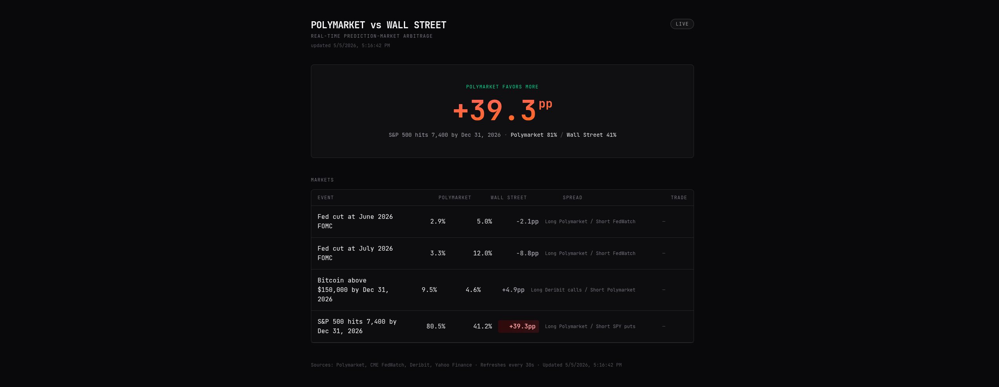

# Polymarket vs Wall Street

Cross-market arbitrage dashboard. Compares Polymarket prediction-market odds against Wall Street's options-implied probabilities for the same binary events. Highlights divergences in real time.



## What it tracks

Pair set verified against Polymarket Gamma on 2026-05-05.

| Pair | Polymarket source | Wall Street source |
|------|-------------------|--------------------|
| Fed cut at June 2026 FOMC | `will-the-fed-decrease-interest-rates-by-25-bps-after-the-june-2026-meeting` | CME FedWatch (with hardcoded fallback) |
| Fed cut at July 2026 FOMC | `will-the-fed-decrease-interest-rates-by-25-bps-after-the-july-2026-meeting` | CME FedWatch (with hardcoded fallback) |
| Bitcoin > $150k by Dec 31 2026 | `will-bitcoin-hit-150k-by-december-31-2026` | Deribit BTC option chain → Black-Scholes |
| S&P 500 hits 7,400 by Dec 31 2026 | `spx-hit-7400-high-dec-2026` | Yahoo Finance SPY options × 10 → Black-Scholes |

## Architecture

- **Next.js 16** App Router, Tailwind 4, React 19, TypeScript.
- **Server-side cache:** every external `fetch` is wrapped in `next: { revalidate: 300 }` (5 min).
- **Client-side polling:** SWR refreshes `/api/markets` every 30 s.
- **History:** `/api/history` reads `data/history.json` — one entry per pair per UTC day, last 7 days kept. Sparklines render this directly.
- **Demo mode:** `?demo=1` returns a hardcoded snapshot (one pair guaranteed > 15 pp spread for screenshots).
- **Per-pair fallback:** if either data source for a pair fails, that row falls back to the demo snapshot for the pair and is dimmed in the UI.

## Stack

`next@16` · `react@19` · `tailwindcss@4` · `swr@2` · `recharts@3` · `zod@4` · `vitest@4`

## Run

```bash
# Node app
npm install
npm run dev          # http://localhost:3000
npm test             # 52 unit/integration tests
npm run build        # production build
npm run start        # serve the built app

# yfinance sidecar (separate process)
cd sidecar
uv sync
uv run uvicorn yfinance_spy:app --host 127.0.0.1 --port 7301
```

The Node app expects the sidecar on `http://127.0.0.1:7301` (override with `YFINANCE_SIDECAR_URL`). If the sidecar is unavailable, the SPY pair falls back to demo and the rest of the dashboard keeps working.

No API keys required — every source is public.

### Demo mode

Toggle the pill in the top-right, or hit `http://localhost:3000/?demo=1`. The API also exposes the snapshot directly: `curl 'http://localhost:3000/api/markets?demo=1'`.

## Project layout

```
src/
├── app/
│   ├── api/markets/route.ts   GET → live or demo MarketsResponse
│   ├── api/history/route.ts   GET → 7-day spread history
│   ├── layout.tsx             JetBrains Mono + dark theme
│   ├── globals.css            Tailwind 4 + theme vars
│   └── page.tsx               Dashboard (client, SWR)
├── components/
│   ├── DemoToggle.tsx         URL-driven ?demo=1 pill
│   ├── HeroDivergence.tsx     largest-spread hero card
│   ├── MarketRow.tsx          5-col event row + sparkline
│   └── Sparkline.tsx          Recharts mini line, no chrome
└── lib/
    ├── black-scholes.ts       N(d2) for option-implied probability
    ├── spread.ts              spread + thresholds
    ├── pairs.ts               4 pair configs
    ├── types.ts               PairSnapshot, MarketsResponse
    ├── demo-snapshot.ts       hardcoded bundle (≥1 pair > 15pp)
    ├── history.ts             file-based 7-day spread store
    └── sources/
        ├── polymarket.ts
        ├── cme-fedwatch.ts
        ├── deribit.ts
        └── yahoo-spy.ts          → calls sidecar at :7301
sidecar/
├── pyproject.toml                yfinance + fastapi + uvicorn + scipy
└── yfinance_spy.py               GET /spy?target_index&expiry → BS prob
```

## Heads-up

- **Polymarket slugs drift** when markets close or get renamed. If a pair returns 404, swap the slug in `src/lib/pairs.ts` for the closest active equivalent. (The slug set in this repo was already swapped once — the May 2026 FOMC market and the original BTC > $100k market are no longer tradeable.)
- **CME FedWatch** has no formally documented JSON endpoint. The implementation tries a placeholder URL and falls back to a hardcoded snapshot — wire in a real endpoint when one becomes available.
- **Yahoo Finance** now requires a "crumb" anti-scraping token. We delegate to a small Python sidecar (`sidecar/yfinance_spy.py`) that uses the `yfinance` library — it handles the cookie/crumb dance internally. The Node SPY client calls the sidecar on `http://127.0.0.1:7301`. If the sidecar is down, the SPY pair falls back to demo and the rest of the dashboard keeps working.
- **Black-Scholes assumptions** (constant vol, zero-rate, GBM dynamics) are deliberate simplifications. Good enough for headline divergences, not for trading PnL.

## Agent integration

This dashboard is built to be consumed by AI agent runtimes (OpenClaw, Hermes, n8n, etc.) without needing access to the source. See:

- [`AGENTS.md`](AGENTS.md) — entry-point with two paths: "modifying this repo" vs "consuming this dashboard"
- [`docs/agents/api-contract.md`](docs/agents/api-contract.md) — exact JSON schemas, curl examples, cache semantics
- [`docs/agents/divergence-commentator.md`](docs/agents/divergence-commentator.md) — runtime-agnostic reference agent: system prompt, polling cadence, alert thresholds, output format

## Extensions

- Pipe spread alerts to Discord / Telegram via webhook when divergence crosses a threshold (see the divergence-commentator reference).
- Add a 5th pair — election markets, geopolitics, sports, anything Polymarket prices that has a Wall Street counterpart.
- Wire a NewsAPI feed that surfaces headlines whenever a spread blows out.

## Credit

Source tutorial: [Polymarket vs Wall Street](https://docs.google.com/document/u/0/d/1DOm7NpJFPlWoDvZzTUCrhYq_0BwRbreB487ZO1Cg05M/mobilebasic). Built without Emergent — Next.js stack assembled directly via subagent-driven development on Akane (Pi 5).

## License

MIT.
